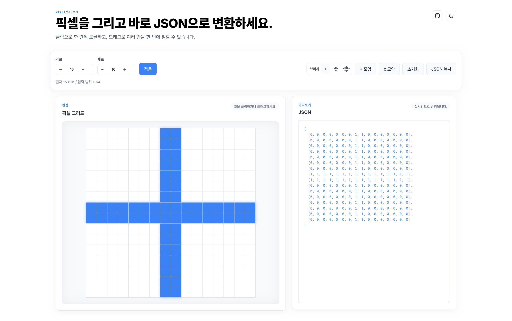

# PIXEL2JSON

픽셀을 그리고 바로 JSON (0과 1로 이루어진 2차원 배열)으로 변환해주는 웹 도구입니다.



## 주요 기능

* **픽셀 그리기**: 클릭으로 한 칸씩 토글하거나, 마우스를 드래그하여 여러 칸을 한 번에 부드럽게 칠할 수 있습니다.
* **브러시 크기 조절**: S, M, L 세 가지 크기의 브러시를 지원하여 넓은 영역도 쉽게 칠할 수 있습니다.
* **그리드 크기 설정**: 1x1부터 최대 64x64까지 가로/세로 픽셀 그리드 크기를 자유롭게 변경할 수 있습니다.
* **실시간 JSON 변환**: 화면에 그린 픽셀 모양이 즉시 0과 1로 이루어진 2차원 배열 형태의 JSON으로 우측에 나타납니다.
* **테마 지원**: 라이트 모드와 다크 모드를 지원합니다.

## 로컬에서 실행하기

1. 패키지를 설치합니다:
   ```bash
   pnpm install
   ```

2. 개발 서버를 실행합니다:
   ```bash
   pnpm run dev
   ```

3. 브라우저에서 `http://localhost:5173` 으로 접속하여 사용합니다.

## 기여

이슈, PR 등 기여는 언제나 환영입니다.

## LICENSE

MIT